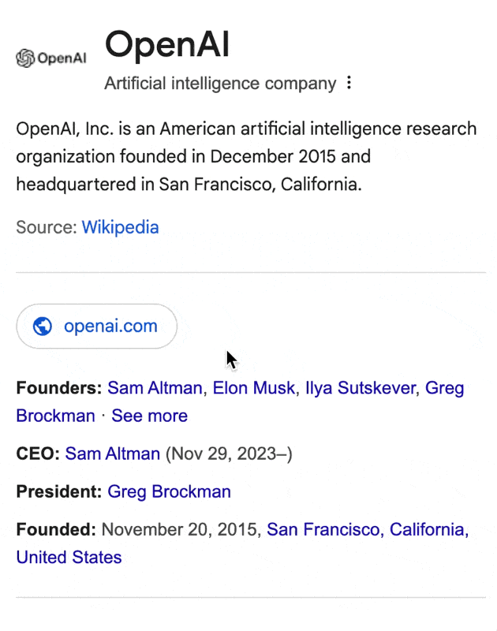

[![][image-banner]][website]

An open-source AI-powered language learning extension for browsers. 
Supports immersive translation, article analysis, multiple AI models, and more.
Master languages effortlessly and deeply with AI, right in your browser.

**English** | [简体中文](./README.zh-CN.md) | [Official Website](https://readfrog.app)

<!-- SHIELD GROUP -->

[![][extension-release-shield]][github-release-link]
[![][chrome-version-shield]][chrome-store-link]
[![][edge-version-shield]][edge-store-link]
[![][website-release-shield]][github-release-link] 
[![][star-history-shield]][star-history-link]
[![][contributors-shield]][contributors-link]
![][last-commit-shield]
[![][issues-shield]][issues-link] 
[![][discord-shield]][discord-link]
[![][chrome-users-shield]][chrome-store-link]
[![][edge-users-shield]][edge-store-link] 
[![][sponsor-shield]][sponsor-link]

<kbd>Table of contents</kbd>

#### TOC

####

 

## 👋🏻 Getting Started & Join Our Community

Read Frog's vision is to provide an easy-to-use, intelligent, and personalized language learning experience for language learners of all levels. This has become possible in the AI era, but there are few products on the market that meet this demand. Therefore, we decided to take matters into our own hands and ultimately make the world no longer reliant on human language instructors.

Whether you are a user or a developer, Read Frog will be an important part of your journey toward this vision. Please be aware that Read Frog is currently under active development, and feedback is welcome for any [issues][issues-link] encountered.

| [![][discord-shield-badge]][discord-link] | In Discord ask questions, and connect with developers.                                 |
| :---------------------------------------- | :------------------------------------------------------------------------------------- |
| [![][wechat-shield-badge]][wechat-link]   | If you are in mainland China, you can add the WeChat account to join the WeChat group. |

> \[!IMPORTANT]
>
> **⭐️ Star Us**, You will receive all release notifications from GitHub without any delay \~

  <kbd>Star History</kbd>

<a href="https://www.star-history.com/#mengxi-ream/read-frog&Timeline">
 <picture>
   <source media="(prefers-color-scheme: dark)" srcset="https://api.star-history.com/svg?repos=mengxi-ream/read-frog&type=Timeline&theme=dark" />
   <source media="(prefers-color-scheme: light)" srcset="https://api.star-history.com/svg?repos=mengxi-ream/read-frog&type=Timeline" />
   
 </picture>
</a>

## 📺 Demo

  
  

## 📦 Download

| Browser | Version                                         | Download                                                          |
| ------- | ----------------------------------------------- | ----------------------------------------------------------------- |
| Chrome  | [![][chrome-version-shield]][chrome-store-link] | [Chrome Web Store](chrome-store-link) or [中国镜像](crxsoso-link) |
| Edge    | [![][edge-version-shield]][edge-store-link]     | [Microsoft Edge Addons](edge-store-link)                          |

## 📖 Introduction

Transform your everyday web reading into an immersive language learning journey! Read Frog is your intelligent companion that makes language learning natural and enjoyable.

✨ Key Features:

- Immersive Translation: Translate elements directly adjacent to the original elements on the webpage
- Smart Content Extraction: Automatically identifies and extracts the main content from articles
- Comprehensive Explanations: Get detailed explanations of words, phrases, and sentences based on your language level
- Contextual Learning: Learn languages through content you're actually interested in
- Multiple AI Models: OpenAI, DeepSeek, and more in the future

✨ 主要特点：

- 沉浸式翻译：直接翻译页面中相邻的元素
- 智能内容提取：自动识别并提取文章的主要内容
- 全面解释：根据您的语言水平，获取单词、短语和句子的详细解释
- 情境学习：通过您真正感兴趣的内容来学习语言
- 多种AI模型：OpenAI、DeepSeek，未来还将支持更多

Whether you're reading news, articles, or any web content, Read Frog helps you understand and learn languages in depth. It's like having a language teacher right in your browser!

Perfect for:

- Language learners who want to learn through authentic content
- Readers who want to understand foreign language articles better
- Anyone who wants to make their web browsing more educational

Join our growing community of language learners and help shape the future of Read Frog!

## 🤝 Contribute

Understand the project through AI: [DeepWiki](https://deepwiki.com/mengxi-ream/read-frog)

Check out the [Contribution Guide](https://readfrog.app/en/tutorial/contribution) for more details.

### Thanks to our Contributors

## ❤️ Support us

If you like Read Frog, you can give a star ⭐️ at Github.

## ⭐ Star History

<a href="https://www.star-history.com/#mengxi-ream/read-frog&Timeline">
 <picture>
   <source media="(prefers-color-scheme: dark)" srcset="https://api.star-history.com/svg?repos=mengxi-ream/read-frog&type=Timeline&theme=dark" />
   <source media="(prefers-color-scheme: light)" srcset="https://api.star-history.com/svg?repos=mengxi-ream/read-frog&type=Timeline" />
   
 </picture>
</a>

<!-- LINK GROUP -->

[image-banner]: /docs/store/large-promo-tile.png
[website]: https://readfrog.app
[extension-release-shield]: https://img.shields.io/github/package-json/v/mengxi-ream/read-frog?filename=apps%2Fextension%2Fpackage.json&style=flat-square&label=extension&color=brightgreen&labelColor=black
[github-release-link]: https://github.com/mengxi-ream/read-frog/releases
[chrome-version-shield]: https://img.shields.io/chrome-web-store/v/modkelfkcfjpgbfmnbnllalkiogfofhb?style=flat-square&label=Chrome&labelColor=black
[edge-version-shield]: https://img.shields.io/badge/dynamic/json?style=flat-square&logo=microsoft-edge&label=Edge&query=%24.version&url=https%3A%2F%2Fmicrosoftedge.microsoft.com%2Faddons%2Fgetproductdetailsbycrxid%2Fcbcbomlgikfbdnoaohcjfledcoklcjbo&labelColor=black&prefix=v
[chrome-users-shield]: https://img.shields.io/chrome-web-store/users/modkelfkcfjpgbfmnbnllalkiogfofhb?style=flat-square&label=Chrome%20users&color=orange&labelColor=black
[edge-users-shield]: https://img.shields.io/badge/dynamic/json?style=flat-square&logo=microsoft-edge&label=Edge%20users&query=%24.activeInstallCount&url=https%3A%2F%2Fmicrosoftedge.microsoft.com%2Faddons%2Fgetproductdetailsbycrxid%2Fcbcbomlgikfbdnoaohcjfledcoklcjbo&labelColor=black
[discord-shield]: https://img.shields.io/discord/1371229720942874646?style=flat-square&label=Discord&logo=discord&logoColor=white&color=5865F2&labelColor=black
[last-commit-shield]: https://img.shields.io/github/last-commit/mengxi-ream/read-frog?style=flat-square&labelColor=black
[issues-shield]: https://img.shields.io/github/issues/mengxi-ream/read-frog?style=flat-square&labelColor=black
[issues-link]: https://github.com/mengxi-ream/read-frog/issues
[contributors-shield]: https://img.shields.io/github/contributors/mengxi-ream/read-frog?style=flat-square&labelColor=black
[contributors-link]: https://github.com/mengxi-ream/read-frog/graphs/contributors
[star-history-shield]: https://img.shields.io/github/stars/mengxi-ream/read-frog?style=flat-square&label=stars&color=yellow&labelColor=black
[star-history-link]: https://www.star-history.com/#mengxi-ream/read-frog&Timeline
[website-release-shield]: https://img.shields.io/github/package-json/v/mengxi-ream/read-frog?filename=apps%2Fwebsite%2Fpackage.json&style=flat-square&label=website&color=success&labelColor=black
[chrome-store-link]: https://chromewebstore.google.com/detail/read-frog-open-source-ai/modkelfkcfjpgbfmnbnllalkiogfofhb
[edge-store-link]: https://microsoftedge.microsoft.com/addons/detail/read-frog-open-source-a/cbcbomlgikfbdnoaohcjfledcoklcjbo
[discord-link]: https://discord.gg/ej45e3PezJ
[sponsor-shield]: https://img.shields.io/github/sponsors/mengxi-ream?style=flat-square&label=Sponsor&color=EA4AAA&labelColor=black
[sponsor-link]: https://github.com/sponsors/mengxi-ream
[discord-shield-badge]: https://img.shields.io/badge/chat-Discord-5865F2?style=for-the-badge&logo=discord&logoColor=white&labelColor=black
[wechat-shield-badge]: https://img.shields.io/badge/chat-WeChat-07C160?style=for-the-badge&logo=wechat&logoColor=white&labelColor=black
[wechat-link]: ./docs/wechat.jpg
[crxsoso-link]: https://www.crxsoso.com/webstore/detail/modkelfkcfjpgbfmnbnllalkiogfofhb
